SPW4 - Exercise 3
=================

Name: _____________

Effort in hours: __

## 1. Connect Four Web Application and CI/CD Pipeline

### Task 1.a

Manuell:

Compile:

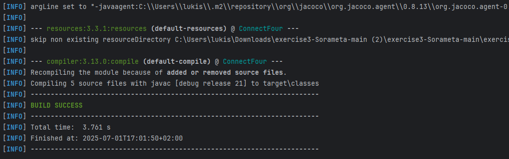

Test:

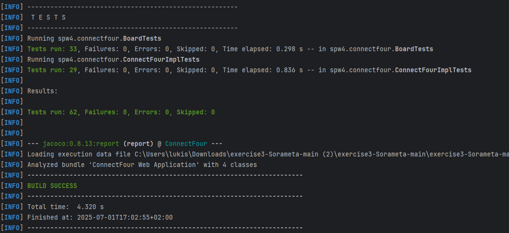

Package:

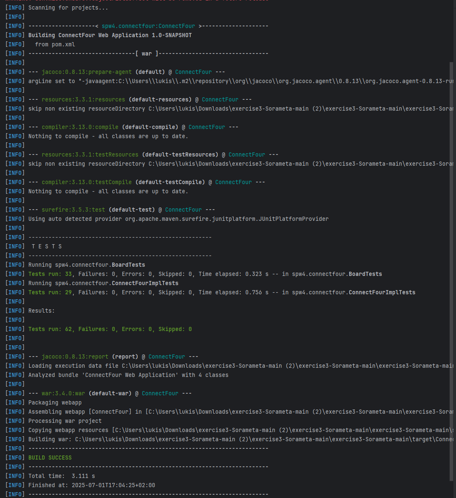

Tomcat:

Website:
Leider ist die Logik umgekehrt dargestellt auf der Website, weswegen die Dots nicht nach unten fallen.

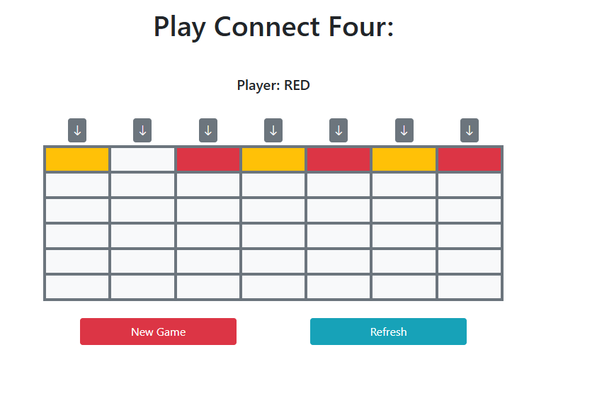

Link:

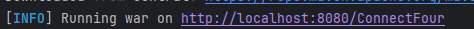

### Task 1.b
Automatisch:

Ist in der .gitlab-ci.yml Datei zu sehen, da wurden die Pipelines Konfiguriert.

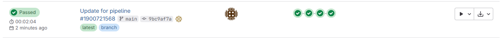

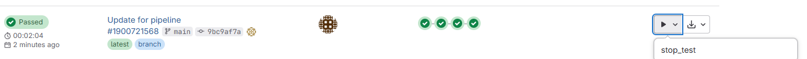

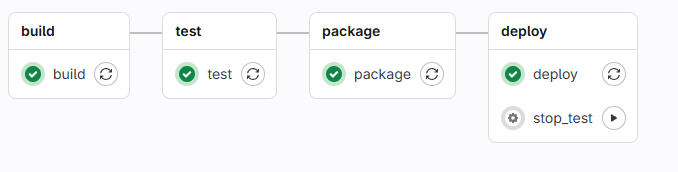

Build:

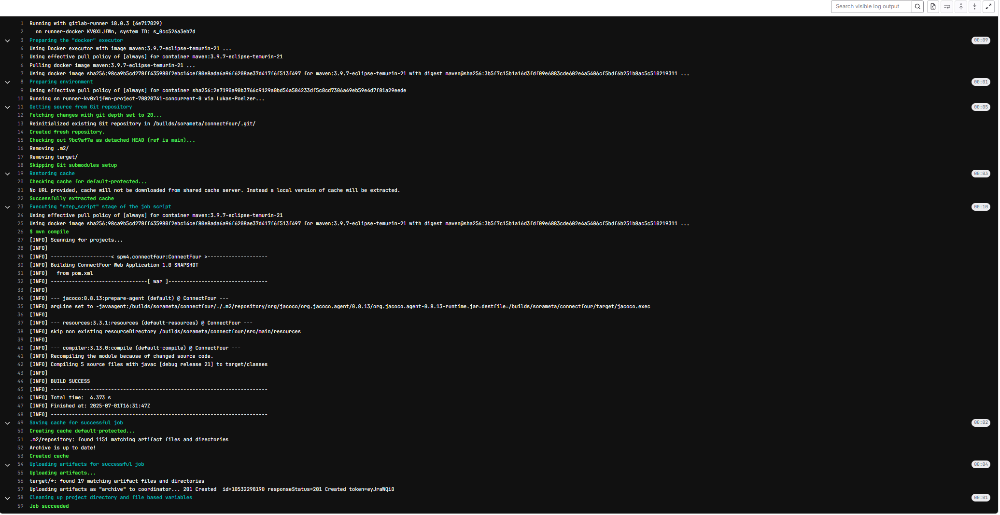

Test:

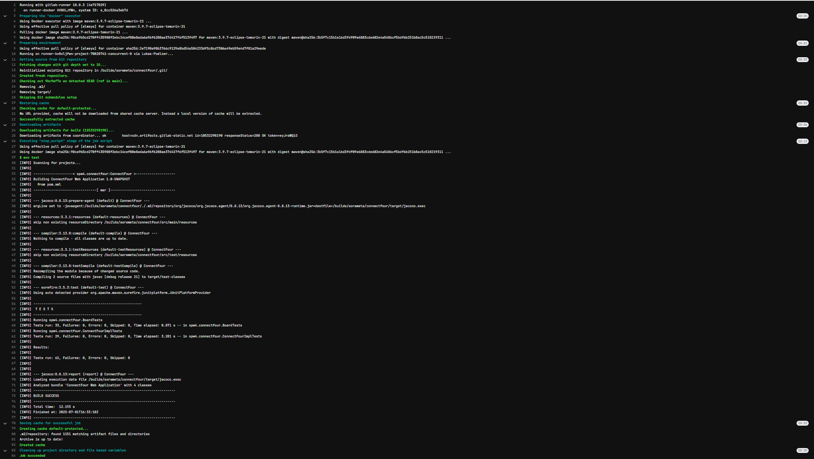

Package:

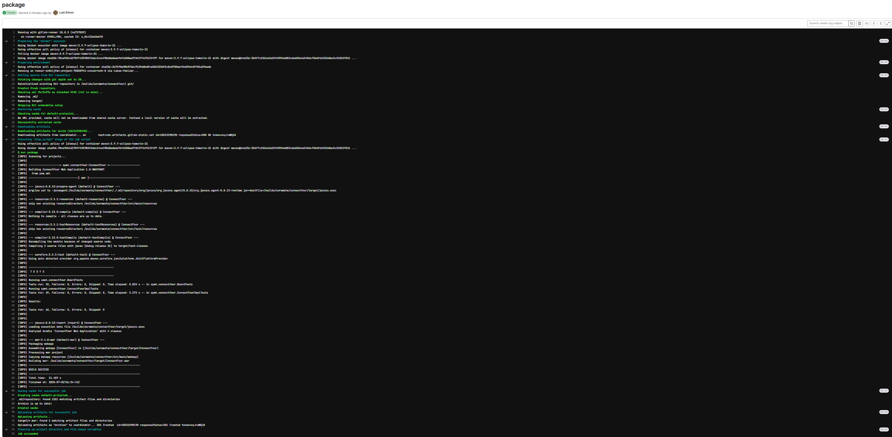

Deploy:

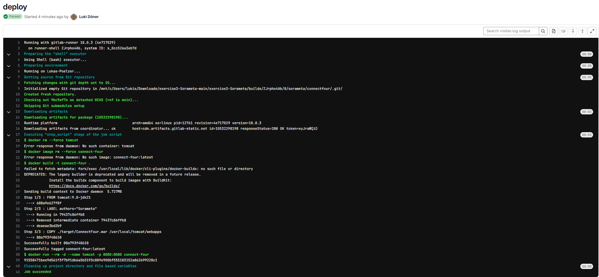

Stop Test Manuell ausgelöst:

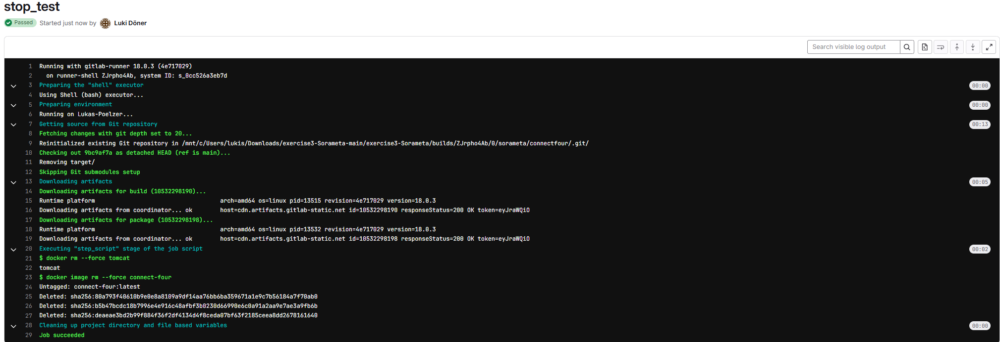

### Task 1.c

Nicht gemacht.
